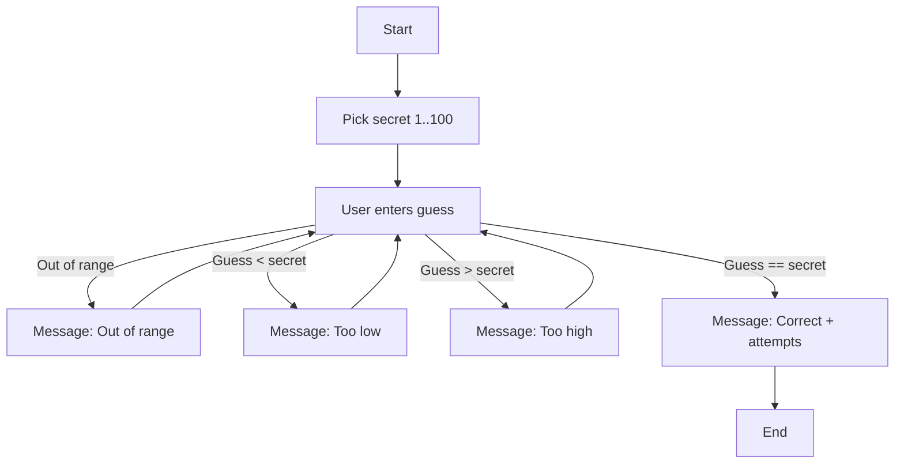

# 🎯 TDD Guessing Game

A simple number guessing game (1–100) implemented in Java using **Test-Driven Development (TDD)**.  
This project was developed to practice **clean code design, unit testing, and collaborative coding practices** (simulated solo).  

---
## 🚀 How to Run the Program

### Run in IDE (Eclipse/IntelliJ)
1. Import the project folder into your IDE.  
2. Ensure **JUnit 5** is added to the project’s Build Path.  
3. Run `Main.java` as a **Java Application** to play the game.  
4. Run `GuessingGameTest.java` as a **JUnit Test** to verify functionality.

---

## 📝Example Output
### Game Output

### Guessing Game Test Output

---

## 📌 Features
- Randomly generated secret number between 1 and 100  
- User guesses until correct  
- Clear feedback after each guess:
  - *Too Low* / *Too High* / *Out of Range*  
- Attempts counter  
- Console-based interaction  

---

## 🧪 Test-Driven Development
The game was built with **JUnit 5 tests written first**, then implementation added step by step.  
TDD flow followed the **Red → Green → Refactor** cycle:

1. Write failing test (`Red`)  
2. Implement minimal logic to pass test (`Green`)  
3. Refactor code for clarity and maintainability  

### ✅ Coverage Includes
- Range validation in constructor  
- Handling of out-of-range guesses (not counted as attempts)  
- Typical flow: low → high → correct  
- Idempotent behavior after game ends  
- Boundary values (1 and 100)  
- Multiple invalid guesses before success  

---

## 🏗️ Architecture
The code is divided into three classes:  

- **`GuessingGame`**: Pure game logic, no I/O, testable.  
- **`GuessingGameTest`**: JUnit 5 test suite for TDD.  
- **`Main`**: Console runner (handles user I/O).

### Game Flow Diagram

---

## 📝 Reflection
Although this project was originally designed for pair programming, I implemented it independently while simulating collaborative practices.  

- I alternated between the **driver role** (writing code/tests) and the **navigator role** (reviewing/refactoring code).  
- I practiced GitHub workflows like commits and self-reviews to mimic collaboration.  
- Some challenges I faced included setting up Eclipse packages correctly and configuring JUnit 5.  

**Key Learnings:**
- Writing tests first (TDD) helped keep the implementation focused and reduced debugging time.  
- Separating logic (`GuessingGame`) from I/O (`Main`) made the code easier to test and maintain.  
- Even when working solo, applying pair programming strategies improved the overall quality of the project.  

---

